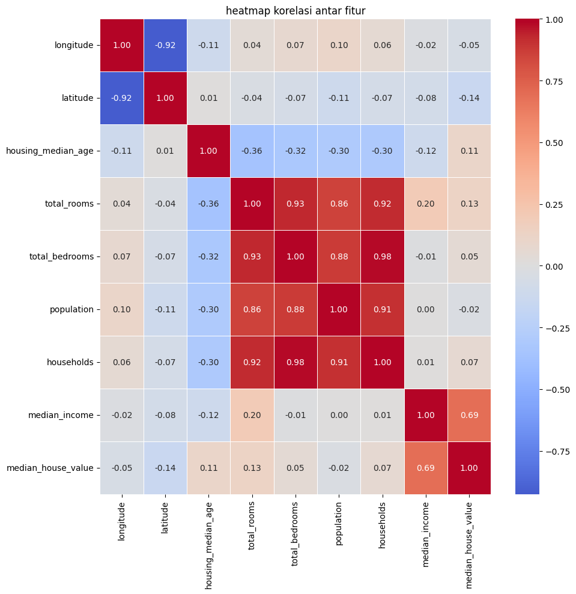
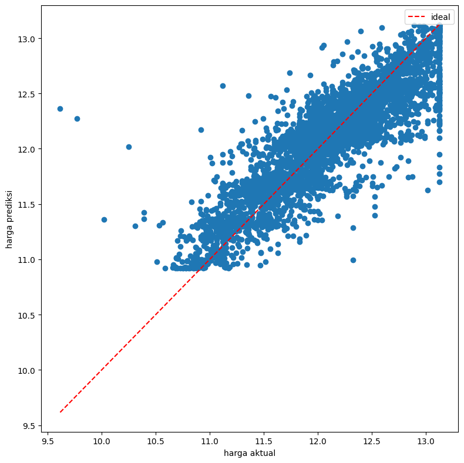

# 🏠 California Housing Price Prediction

Proyek Machine Learning untuk memprediksi harga rumah di California berdasarkan data sensus perumahan (California Housing Dataset). Proyek ini mencakup analisis eksplorasi data (EDA), korelasi fitur, preprocessing data, dan pemodelan regresi.

---

## 📊 Gambaran Proyek (Project Overview)

Tujuan dari proyek ini adalah memprediksi `median_house_value` (nilai median harga rumah) berdasarkan berbagai fitur geografis dan demografis seperti lokasi (`longitude`, `latitude`), umur rumah (`housing_median_age`), jumlah kamar (`total_rooms`), populasi (`population`), pendapatan median (`median_income`), dan kedekatan dengan laut (`ocean_proximity`).

---

## 📁 Struktur Repositori

```text
califor_house_price/
├── housing.csv          # Dataset California Housing
├── main.ipynb           # Jupyter Notebook (EDA, Data Prep, Model Training & Evaluasi)
├── heatmap.png          # Visualisasi Matriks Korelasi Fitur
├── lr.png               # Visualisasi Hasil / Evaluasi Linear Regression
├── requirements.txt     # Daftar dependensi Python yang dibutuhkan
├── .gitignore           # File pengabaian Git
└── README.md            # Dokumentasi proyek
```

---

## 📈 Visualisasi & Analisis Data

### 1. Matriks Korelasi Fitur
Korelasi antar fitur numerik divisualisasikan menggunakan heatmap untuk melihat hubungan fitur terhadap target `median_house_value`.



*Kunci temuan:*
- `median_income` memiliki korelasi positif paling kuat terhadap `median_house_value`.

### 2. Evaluasi Model Regresi
Performa model regresi dalam memprediksi nilai harga rumah.



---

## 🛠️ Cara Menjalankan Proyek Secara Lokal

### 1. Clone Repositori
```bash
git clone https://github.com/USERNAME_GITHUB/califor_house_price.git
cd califor_house_price
```

### 2. Buat dan Aktifkan Virtual Environment (Opsional tapi Direkomendasikan)
```bash
# Windows
python -m venv venv
venv\Scripts\activate

# Linux / MacOS
python3 -m venv venv
source venv/bin/activate
```

### 3. Install Dependensi
```bash
pip install -r requirements.txt
```

### 4. Jalankan Jupyter Notebook
```bash
jupyter notebook main.ipynb
```
atau buka file [main.ipynb](file:///c:/Users/evans/code/PetualanganML/califor_house_price/main.ipynb) langsung di VS Code.

---

## 🧰 Teknologi yang Digunakan
- **Python**
- **Pandas** & **NumPy** - Manipulasi & pengolahan data
- **Matplotlib** & **Seaborn** - Visualisasi data
- **Scikit-Learn** - Preprocessing data & Model Machine Learning
- **Jupyter Notebook** - Eksplorasi interaktif

---

## 👤 Author
- GitHub: [@Evannnkatanya](https://github.com/Evannnkatanya)
